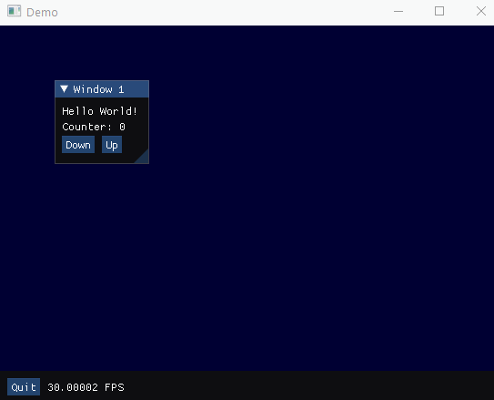

# ImGui.NET FSharp Wrapper

Build rapid GUI applications in FSharp using the excellent [Dear ImGui](https://github.com/ocornut/imgui) via the [ImGui.NET](https://github.com/mellinoe/ImGui.NET) wrapper.

## How?

How about a quick little GUI window from your FSI session?

```fsharp
let commonStatusBar() = 
    Gui.statusBar "Status Bar" [
        Gui.button "Quit" closeGui
        Gui.text $"{ImGui.GetIO().Framerate} FPS"
    ]()

let counter = ref 0
let incr i = fun _ -> counter := !counter + i
let decr i = fun _ -> counter := !counter - i

let page() = 
    Gui.app [
        Gui.window "Window 1" [
            Gui.text "Hello World!"
            Gui.text $"Counter: {!counter}"
            Gui.button "Down" (decr 1) ++ Gui.button "Up" (incr 1)
        ]

        commonStatusBar
    ]()

startGui("Demo", page)
```



How about hot reloading some changes as you rapidly iterate?

```fsharp
let newPage()  = 
    Gui.app [
        Gui.window "Updated!" [
            Gui.text "Updated!"
        ]

        commonStatusBar
    ]()

updateGui newPage
```

And boom!


A more complete demo program is being developed in the [Sample Project](src/ImGui.NET.FSharp.Sample/Program.fs).